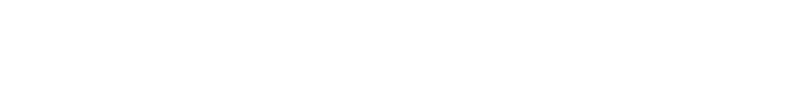

.. _structure-of-requests:

Structure of requests
=====================

Each request has the following structure:

Type of method
--------------

All API methods are ``GET`` or ``POST`` type of requests:

.. code-block:: bash

   curl -X GET/POST ...

Headers
-------

Each request must include an API key for authorization. This key should be added to the request header, replacing ``{Your API Key}`` with your actual key:

.. code-block:: bash

   curl ... -H 'Authorization: {Your API Key}'

API parameters
--------------

Parameters in each request serve as the primary inputs for API endpoints. These parameters vary depending on the context.

Path
~~~~~~~~~~~~~~~

Path parameters specify the endpoint. For instance, a request with these path parameters would include a Twitter profile ID or alias to retrieve Twitter profile data:

.. code-block:: bash

   curl 'https://{DOMAIN}/api/twitter_v2/user?{...}'

Check the :ref:`support` page to get a full list of endpoints.

Query string parameters
~~~~~~~~~~~~~~~~~~~~~~~

Query string parameters provide the necessary input data for endpoints and include technical details for the request. For instance, a request with the following query string parameters would include endpoint data in the query parameter and technical details such as ``timeout``, ``delayed``, ``task_timeout``, ``task_id``, ``limit``, etc.:

.. code-block:: bash

   curl 'https://{DOMAIN}?query={...}&timeout={...}&delayed={...}&task_timeout={...}&task_id={...}&limit={...}'

Learn more about query string parameters on the :ref:`usage-of-parameters` page.
